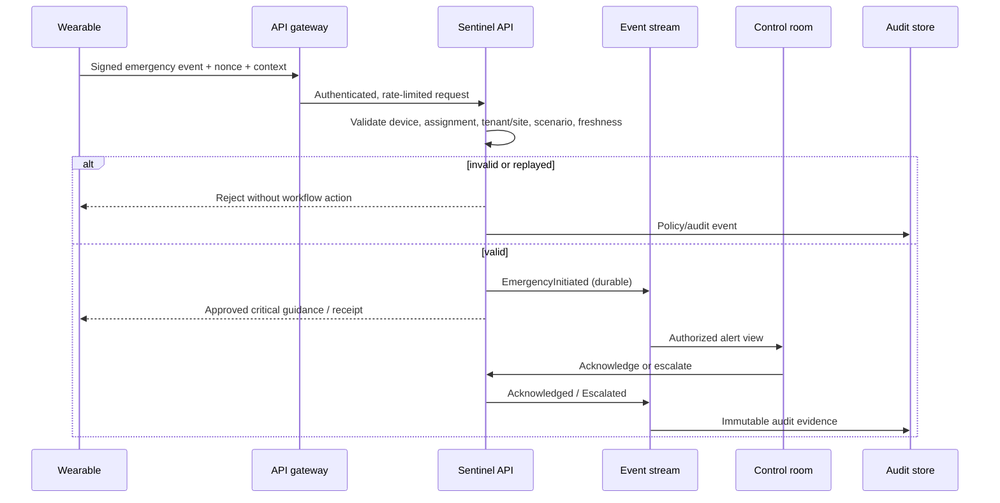
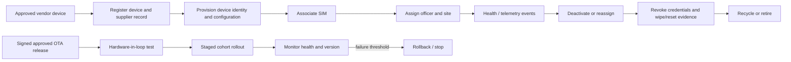
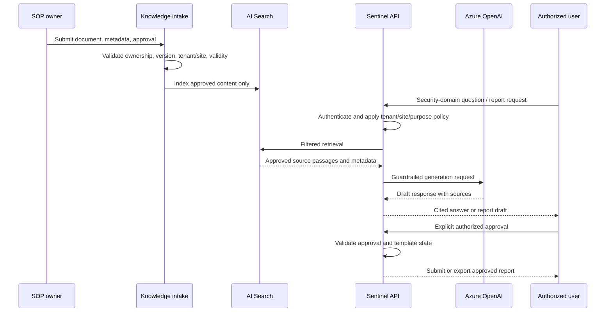
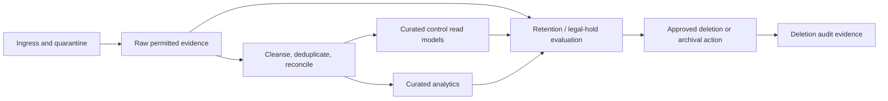

# Sentinel data flows

**Related:** [Architecture overview](overview.md), [Platform strategy](../project-context/data-platform-strategy.md), and [Security governance](security-governance.md).

## 1. Emergency alert and acknowledgement

The device interaction uses synchronous request/response only for a limited receipt or approved guidance path. Alert delivery, control-room updates, escalation, notifications, audit persistence, and analytics consume durable events. Acknowledgement state must distinguish requested, delivered, displayed, acknowledged, and escalated outcomes.

## 2. Device lifecycle and OTA flow

The vendor adapter owns protocol-specific behaviour. Sentinel owns lifecycle state, authorization, evidence, rollout policy, and tenant/site reassignment controls. A device cannot act for a prior assignment after deactivation or reassignment.

## 3. SOP retrieval and human-reviewed reporting

The application rejects off-topic requests and treats retrieved text as untrusted input. No model output can submit a report or command a device. Corpus, prompt, model/deployment, retrieval, output, and approval versions require audit evidence.

## 4. Data refinement, retention, and deletion

Audio is provisionally retained for 30 days; transcripts and reports are provisionally retained for two years. These are not final policies. Retention, legal-hold, archival, backup, restoration, and deletion behaviour must be validated with privacy/legal, customers, and operations before production.

## 5. Processing boundaries and canonical event envelope

| Processing mode | Appropriate workloads |
|---|---|
| Synchronous | Device authentication outcome, emergency receipt, constrained guidance, user acknowledgement requests. |
| Event-driven | Alerts, telemetry, location, geofence, assignment, delivery, escalation, OTA, audit, notifications. |
| Batch/micro-batch | Reconciliation, quality checks, analytics, cost reporting, retention verification, model evaluation. |

All canonical events must include `event_id`, `schema_version`, `event_type`, `device_id` where applicable, `tenant_id`, `site_id`, `correlation_id`, `occurred_at`, `received_at`, producer identity, integrity/signature evidence or validation outcome, and a payload version. Consumers deduplicate on event ID, preserve source order when available, tolerate late events, and route invalid events to quarantine/dead letter with review evidence.

## 6. Storage zones and consumption

| Zone | Access pattern | Primary consumers |
|---|---|---|
| Ingress/quarantine | Restricted write and reviewer read. | Validation and security/data operations. |
| Raw evidence | Append/replay; tightly restricted. | Reconciliation, authorized investigation, retention control. |
| Cleansed operational | Event/state processing. | Control projections, lifecycle services, quality controls. |
| Curated control | Low-latency, role-scoped reads. | Control-room and authorized supervisor views. |
| Curated analytics | Governed aggregate/query access. | Product, operations, and commercial analysis. |
| Knowledge corpus | Approval-managed retrieval only. | RAG service through Sentinel API. |

## Open decisions and validation items

- Define delivery and acknowledgement semantics with the wearable vendor and control-room team.
- Validate field retry/backoff, duplicate, offline, clock, location precision, and cellular failure behaviour.
- Confirm the final retention, backup, legal-hold, and deletion obligations per data class.
- Confirm report-submission integration versus controlled manual export and required regulator formats.