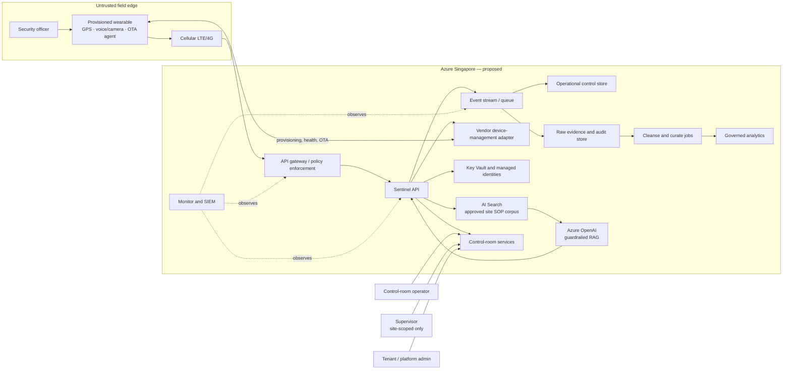

# Sentinel architecture overview

**Status:** Proposed architecture; Azure capabilities, regional availability, supplier capabilities, compliance interpretation, and final retention policy require validation.

Sentinel is a managed edge-to-cloud platform for cellular security wearables. A provisioned wrist device communicates over LTE/4G with Azure-hosted ingress services. The cloud validates every request, records auditable events, provides role-scoped control-room workflows, and optionally supplies cited answers from approved site SOPs. The wearable is a managed endpoint, not the authority for identity, policy, tenancy, or incident-report submission.

## Component relationships

- **Wearable and cellular network:** submit signed or integrity-protected telemetry, GPS, alerts, and approved requests. Cellular delivery can be delayed, duplicated, or unavailable.
- **API gateway and Sentinel API:** authenticate, enforce device/request freshness, validate tenant/site/role/scenario/schema, apply rate limits, and publish durable events. Synchronous responses are limited to the guidance or acknowledgement path.
- **Event and data layers:** retain permitted evidence separately from operational read models and curated analytics. Consumers are idempotent and record both occurred and received times.
- **Control-room services:** expose authorized current alert, escalation, assignment, and fleet views. Supervisors do not access officer-to-device transcripts.
- **AI services:** retrieve only approved, tenant/site-filtered SOP content. The application—not the model—enforces authorization, citations, security-domain scope, refusal, and human report approval.
- **Device-management adapter:** isolates vendor-specific provisioning, SIM association, health, firmware, staged OTA, rollback, deactivation, reset, and recycling behavior.

## Trust boundaries and data classes

| Boundary | Primary controls | Data classes |
|---|---|---|
| Wearable/cellular to Azure ingress | Device identity, TLS, freshness, nonce/sequence, schema validation, rate limiting, replay handling. | Device identifier, location, telemetry, alert, permitted audio metadata. |
| API to internal services | Managed identity, least privilege, private connectivity where supported, correlation IDs, audit logs. | Tenant/site context, operational events, assignment and workflow state. |
| Knowledge and AI boundary | Document approval, tenant/site metadata filters, output guardrails, citations, red-team tests. | SOP content, prompts, retrieval metadata, draft reports. |
| Control-room/user boundary | User authentication, RBAC/ABAC, site scope, transcript prohibition, access audit. | Active incidents, fleet state, site-level operational records. |
| Analytics boundary | Curated metrics, approved purpose, aggregation/minimisation, lineage, restricted raw-data access. | Assurance, response, device-health, and service metrics. |

## Architectural decisions

1. **Cloud-authoritative orchestration:** the device reports facts and receives constrained actions; the cloud owns authorization, workflows, and records.
2. **Event-driven critical operations:** alerts, acknowledgement, escalation, lifecycle, and telemetry are asynchronous facts; analytics and reconciliation are batch or micro-batch.
3. **Human-controlled AI:** fixed approved prompts govern critical scenarios; RAG assists with SOP queries and reports but cannot command devices or submit reports.
4. **Zero-trust multi-tenancy:** tenant/site identifiers, policy checks, and auditability are required throughout ingress, events, data, control-room access, and retrieval.
5. **Intermittent-connectivity resilience:** retries, idempotency, time reconciliation, delivery state, and visible uncertainty are required. GPS/geofence events are advisory, not proof of officer conduct.

## Open decisions and validation items

- Confirm wearable vendor SDK, device certificate/key model, offline behaviour, data wipe support, OTA rollback, battery performance, and supplier continuity.
- Confirm Azure Singapore service/model availability, processing location, quotas, private connectivity, disaster recovery options, and cost.
- Complete DPIA, legal basis/notice review, final audio/transcript/report retention policy, access-request process, and contract controls.
- Confirm customer identity provider, control-room escalation ownership, report-submission path, and source SOP ownership.
