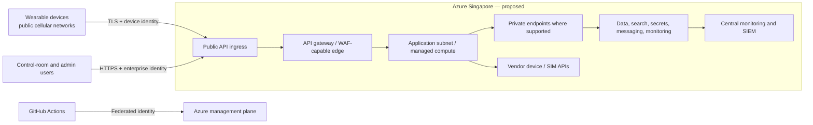

# Sentinel network security architecture

**Status:** Proposed topology. Azure service support, private endpoint coverage, address design, customer connectivity, and carrier/vendor requirements require validation.

## 1. Network topology and trust zones

The wearable requires a public internet-reachable ingress path because it operates on cellular networks. Managed services and administration paths should use private connectivity where available and justified. Public access to data stores, secrets, internal event interfaces, management endpoints, and control-plane operations should be disabled or restricted unless an explicit validated exception exists.

## 2. Proposed segmentation

| Zone | Purpose | Inbound policy | Outbound policy |
|---|---|---|---|
| Public ingress | Accept device and user HTTPS/API traffic. | HTTPS only through approved edge/gateway controls. | Route only to application ingress/service. |
| Application | Host Sentinel API, workers, control services, and vendor adapters. | Gateway and approved management paths only. | Approved private services, diagnostics, vendor/carrier APIs with allowlists where feasible. |
| Data and AI | Store events, operational state, artifacts, search indexes, secrets, analytics. | Private endpoints/application identities only where supported. | Minimal required managed-service traffic. |
| Management and delivery | Terraform, CI/CD, privileged administration. | Federated CI/CD and approved admins. | Azure management plane and approved deployment endpoints. |
| Monitoring/security | Collect diagnostics, security signals, and audit exports. | Diagnostic producers only. | SIEM/SOC integrations approved by security. |

Use separate development, staging, and production environments with independent identities, secrets, diagnostic destinations, and deployment approvals. Subscription/resource-group boundaries, VNet peering, and shared-service design require cloud/security validation.

## 3. Public ingress controls

Device and user traffic terminates at a protected API gateway. Required controls include TLS, certificate management, device/user authentication, API schema validation, request-size and method restrictions, rate/quotas, bot/DDoS/WAF capabilities where applicable, IP reputation or allowlist policy where feasible, request correlation IDs, replay/freshness checks, and security logging.

Do not depend on static mobile-carrier IP allowlists as the primary device security control. Cellular addressing can change. Device identity, request integrity, and application authorization are required even if network filtering is available. All public API routes must be explicitly documented; management, debug, metadata, and data-store endpoints must not be exposed through the device ingress path.

## 4. Private connectivity, DNS, and service access

For services that support it in the chosen region/SKU, use private endpoints or equivalent private service access for secrets, storage, messaging, operational data, search, analytics, and monitoring ingestion/query paths. Associate private endpoints with private DNS zones and configure application/network DNS resolution so private names resolve consistently. Disable public network access only after deployment, monitoring, CI/CD, break-glass, and recovery paths have been tested.

Network security groups, route tables, firewalls, and managed service firewall settings must enforce default deny and explicit required flows. The final network design needs a flow matrix listing source, destination, protocol, port, identity, purpose, owner, logging, and review date. Use egress controls to limit application traffic to Azure dependencies, approved vendor device-management endpoints, SIM/carrier endpoints, package/update sources, and diagnostic destinations.

## 5. Vendor, carrier, and customer integration

The vendor device-management and carrier/SIM interfaces are third-party trust boundaries. Use dedicated integration identities, scoped API permissions, secret rotation, outbound allowlists where practical, request logging without secret exposure, retry/circuit-breaker controls, and vendor outage monitoring. Avoid allowing a vendor integration to write directly to Sentinel operational or tenant data stores.

VPN/ExpressRoute is not an MVP dependency. It may be considered when a validated customer requires private connectivity from a control room or corporate system. Such connectivity must use separate routing, DNS, identity, segmentation, and monitoring design rather than extending the public device ingress zone.

## 6. Certificate and DNS management

Use managed or centrally controlled certificate lifecycle processes for public API domains, private endpoints, device TLS trust, and any mutual-authentication design. Define issuance, renewal, revocation, expiry monitoring, emergency replacement, and ownership. Device certificate provisioning/rotation must be consistent with vendor capabilities and tested before fleet deployment.

DNS changes are security-sensitive configuration. Maintain infrastructure-as-code records, environment-specific names, private DNS-zone links, split-horizon behaviour where used, change review, monitoring, and rollback steps.

## 7. Network validation checklist

- Confirm Singapore-region availability and supported SKUs for every proposed private endpoint, private DNS integration, firewall, WAF/DDoS, logging, and AI/search service.
- Produce an approved traffic-flow matrix and verify default-deny configurations in each environment.
- Validate device ingress over representative cellular networks, including TLS/certificate failures, replay attempts, rate limits, lost connectivity, and changed IP addresses.
- Validate private name resolution from application workloads, deployment agents, break-glass paths, and recovery processes.
- Test public-access disablement for supported data services without breaking monitoring, backups, deployments, or incident response.
- Perform penetration testing and configuration review for public APIs, tenant/site authorization, cloud identity, vendor integration, and egress controls.
- Confirm whether pilot/control-room customers require VPN/ExpressRoute, IP restrictions, customer identity federation, or dedicated environment boundaries.

## Open decisions and validation items

- Select CIDR ranges, subnet count, peering/hub-spoke model, firewall tier, WAF/DDoS features, and private endpoint coverage.
- Confirm vendor/carrier endpoint locations, certificate/authentication mechanisms, IP/FQDN requirements, and support for outbound restriction.
- Confirm customer control-room connectivity and identity federation needs.
- Confirm operational ownership for network changes, security-event triage, certificate rotation, and emergency break-glass access.
